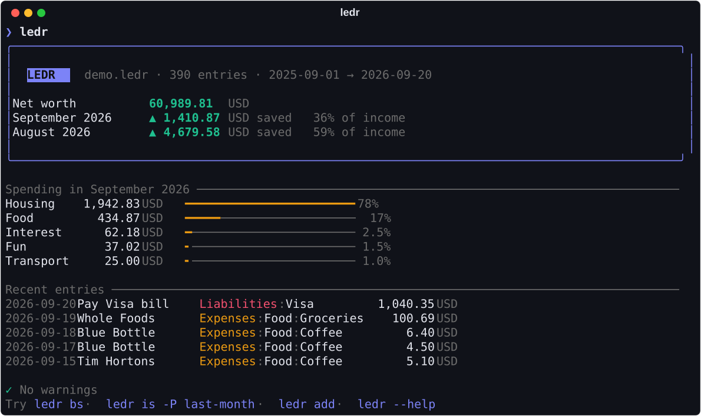
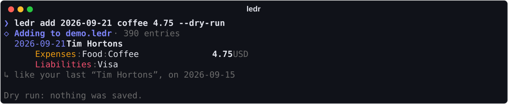
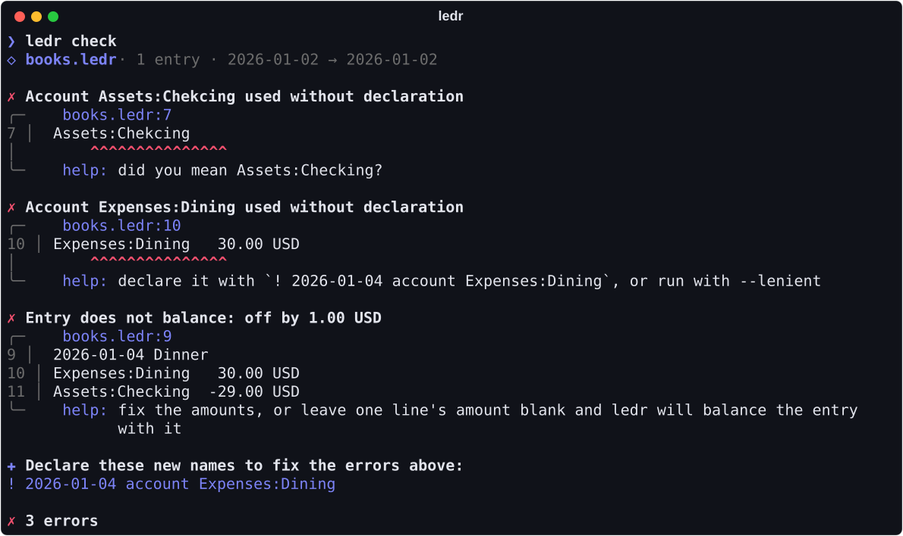
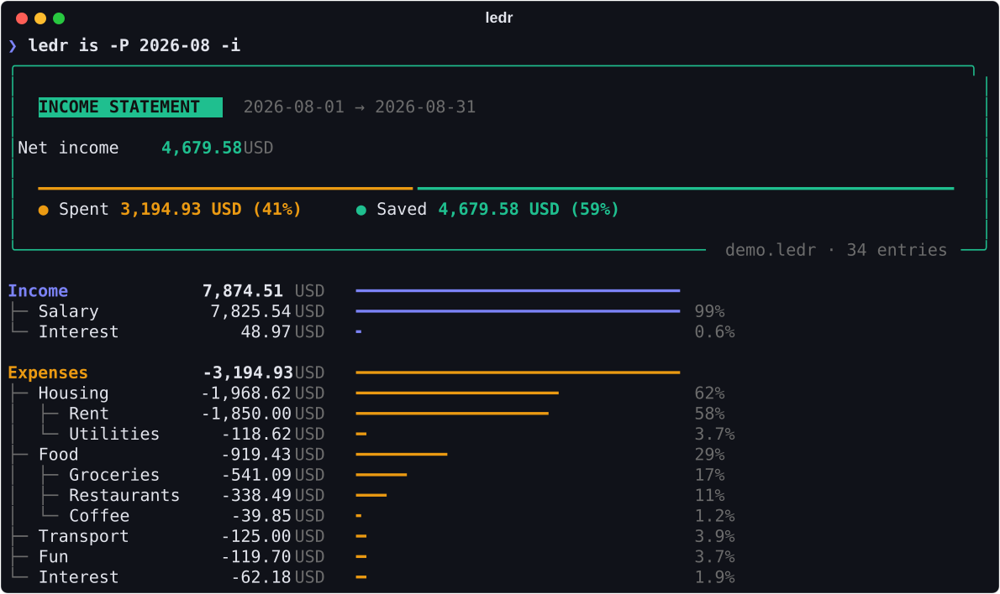
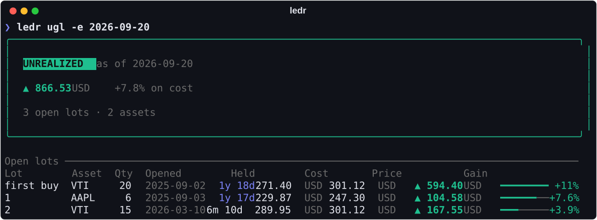

<h1 align="center">ledr</h1>

<p align="center">
  <b>Plain text accounting with rock-solid math, and a pleasure to use.</b><br>
  Keep your books in text files. Ledr checks them, reports on them, and helps you write them.
</p>

<p align="center">
  <a href="https://github.com/adamtrain/ledr/actions/workflows/rust.yml"></a>
  
  <a href="COPYING"></a>
</p>

<p align="center">
  
</p>

## Why ledr

- **Exact.** Every amount is an exact fraction until the moment it's shown, then rounded
  half-to-even. Numbers that can't be represented exactly are an error, never a silent guess.
- **Easy to write.** `ledr add coffee 4.50` finds your last coffee and reuses its accounts. Or run
  `ledr add` and it asks for each part, suggesting from your history as you type. Either way, it
  checks the entry against the whole ledger before saving it.
- **Tidy by itself.** `ledr tidy` lines amounts up on their decimal points across every file,
  without touching a comment or changing what anything means.
- **Helpful when things go wrong.** Errors point at the exact line, suggest the account you
  probably meant, and `ledr check` reports every problem at once.
- **Multicurrency and investments.** Exchange rates from rate directives and your own
  conversions, converted through as many currencies as it takes. Lots, FIFO or named, with
  realized and unrealized gains.
- **Good-looking, or plain.** In a terminal, reports come with panels, trees, bars and charts.
  Piped, or with `--plain`, they're simple text in the same format ledr has always printed.

## Install

A pre-built binary for macOS (arm64) is on the
[releases page](https://github.com/adamtrain/ledr/releases). To build from source you need a
[Rust toolchain](https://rustup.rs):

```sh
git clone https://github.com/adamtrain/ledr && cd ledr
make && sudo make install     # the binary and man pages, under /usr/local
```

Or just `cargo install --path .` for the binary alone.

## Quick start

Start your books with `ledr init`. It asks where to keep them, what's in each of your accounts,
what you owe, and which categories you spend on, then writes a ledger with those opening
balances. From then on, ledr knows where your books are, so there's no `-f` to type.

```sh
ledr init                     # set up a ledger, with your opening balances
ledr add                      # add an entry, with suggestions
ledr                          # an overview: net worth, recent months, latest entries
ledr bs                       # balance sheet
ledr is -P last-month -i      # last month's income statement, income as positive
ledr check                    # find mistakes
```

Already keep books? `ledr init path/to/books.ledr` makes an existing ledger the default without
changing it. Or pass `-f`, or set `LEDR_FILE`, which take precedence.

Want to try it first? There's a year of made-up finances in `examples/demo.ledr`:

```sh
ledr -f examples/demo.ledr
```

## Writing entries

A ledger is a text file of entries like this one, where one line may leave its amount out to
balance the rest:

```
2026-09-18 Blue Bottle
    Expenses:Food:Coffee      6.40 USD
    Liabilities:Visa
```

You can write them in any editor, but `ledr add` is quicker. Describe the entry in a few words:

```sh
ledr add coffee 4.75                       # like your last coffee, for 4.75
ledr add yesterday rent 1850               # like last month's rent
ledr add fri "Pizza night" 23.50 @restaurants @visa
ledr add "New bike" 340 @Expenses:Hobbies @checking
```

<p align="center">
  
</p>

The first word can be a day (`today`, `yesterday`, `fri`), a date like `03-15` counts anywhere,
the last number is the amount, and `@` marks accounts, which are found by a few letters
(`@visa`, `@chk`). An account where money is kept or owed, like `@visa` or `@checking`, is what
paid; any other is what the money was for, and income is credited, as it always is. The description is matched against past entries, by name or by what they were
for, so `coffee` finds wherever you last bought coffee, and `ledr add coffee 5 @checking` does
the same but paid from checking. Amounts can be arithmetic, like `12.50+3.20`, and can name a
currency, like `4.75 CAD`.

Run `ledr add` with nothing else and it asks for the date, description and each line in turn,
suggesting descriptions and accounts as you type. If you've used a description before, it offers
the same accounts, so all you type is the amount.

Either way, ledr shows the entry and checks it against the whole ledger (balances, lots, account
openings) before writing anything. New accounts get declared automatically, and the entry goes
into the file holding your latest entries, formatted to match it, or into another file the
ledger reads with `--to`. Use `--dry-run` to only look,
and `--yes` to skip the question.

### Keeping files neat

`ledr tidy` shows how it would reformat your files, `ledr tidy --write` does it, and
`ledr tidy --check` fails if anything isn't tidy, for use in CI or a pre-commit hook. It lines
amounts up on their decimal points, evens out spacing and indentation, and writes dates in full.
Comments stay put, and ledr refuses to write anything whose meaning would change. Symbolic links
are followed, read-only files are left alone, and an interrupted write never leaves a file half
written.

### When something's wrong

<p align="center">
  
</p>

`ledr check` reports every error at once: syntax, typos in account and currency names (with
suggestions), entries that don't balance, and warnings about things that are allowed but look
like mistakes, such as a conversion far from the rate declared that day. It even prints the
declarations for new names, ready to paste.

## Reports

| Command | Alias | |
| --- | --- | --- |
| `ledr` | | An overview of the ledger |
| `ledr bs` | `balance` | Balance sheet: assets, liabilities and equity |
| `ledr is` | `income` | Income statement: income and expenses over a period |
| `ledr tb` | `trial` | Trial balance: every account |
| `ledr as ACCOUNT` | `account` | Every entry touching matching accounts, with a running balance |
| `ledr rgl` | `realized` | Realized gains and losses from selling lots |
| `ledr ugl` | `unrealized` | Unrealized gains and losses on lots still held |
| `ledr er` | `rates` | Exchange rates, declared, observed and inferred |
| `ledr fmt` | `print` | Every entry as ledr understands it |
| `ledr find TERM` | | Entries whose description matches |
| `ledr accounts` | | Every account, with how much it's used |
| `ledr payees` | | Every description, with how much it's used |

<p align="center">
  
</p>

<p align="center">
  
</p>

## Options

| Flag | |
| --- | --- |
| `-f, --file FILE` | The ledger to read (default: `$LEDR_FILE`, else the one from `ledr init`; `-` reads stdin) |
| `-b, --begin DATE` | Ignore entries before this date |
| `-e, --end DATE` | Ignore entries after this date |
| `-P, --period PERIOD` | One period instead: `2024`, `2024-03`, `2024-Q1`, `last-month`, `ytd`… |
| `-c, --currency CUR` | Convert balances to this currency where possible |
| `--ioc` | With `-c`, drop balances that can't be converted |
| `-d, --depth N` | Condense accounts nested deeper than this |
| `-i, --invert` | Negate amounts, e.g. to show income as positive |
| `-E, --ignore-equity` | Hide equity accounts |
| `-p, --precision N` | Show at most this many decimal places |
| `--lenient` | Allow accounts and currencies that were never declared |
| `--plain` / `--fancy` | Choose the output style (default: fancy in a terminal) |

Dates can be written `2024-03-15`, `2024-03` or `2024`, or as `today`, `yesterday` or `-30` (days
ago). As a beginning, a month or year means its first day, and as an end, its last, so
`-b 2024 -e 2024` is all of 2024.

Fancy output follows [`NO_COLOR`](https://no-color.org), and uses exact colors if `COLORTERM` is
`truecolor`. If you'd rather have plain output everywhere, set `LEDR_PLAIN=1`. Shell completions come from `ledr completions zsh` (or `bash`, `fish`…).

## Documentation

Ledr has thorough man pages. After `make install`, run `man ledr` to get started.

- **ledr(1)**: command reference with examples
- **ledr(5)**: ledger file format
- **ledr(7)**: how ledr processes files, lots and currency conversion, and data integrity

The `tests` directory also contains examples covering substantially all the syntax.

## Development

```sh
cargo build                     # build
cargo test                      # run the tests
make lint                       # clippy and rustfmt, as CI runs them
make screenshots                # regenerate docs/*.svg (needs uv)
```

The screenshots are rendered by `scripts/screenshots.py`, which runs the real binary on the
made-up ledger in `examples/demo.ledr`; none of the numbers are real.

```
src/
├── main.rs, cli.rs     # the command line
├── commands.rs         # what each command does
├── config.rs           # settings kept between runs: which ledger to read
├── syntax/             # lexing ledger lines; source files and spans
├── parsing/            # reading files and includes; building the ledger
├── gl/                 # the general ledger: entries, balances, exchange rates
├── investment/         # lots and sales
├── reports/            # report models, and their plain rendering
├── render/             # fancy rendering of each report
├── ui/                 # colors, styled text, panels, bars and tables
├── input/              # writing entries: history, fuzzy matching, quick and interactive add,
│                       # and setting up a new ledger
├── tidy.rs             # the formatter
├── diagnostics.rs      # errors and warnings that know where they came from
└── util/               # exact rational numbers, dates, periods, the rate graph
```

## Contributions

I use ledr every day for my own finances and accounting. Development focuses on correctness first,
then on making the everyday work of keeping books as pleasant as possible.

The most important type of contribution you can provide is an example of a ledger that is being
processed incorrectly or unexpectedly, is unintuitive to you, or is unable to represent a
legitimate financial situation that you or someone is in.

## Copyright & License

Copyright © 2024-2026 Adam Train <adam@adametrain.com>

Ledr is licensed under the GPLv3, and will always be free.
